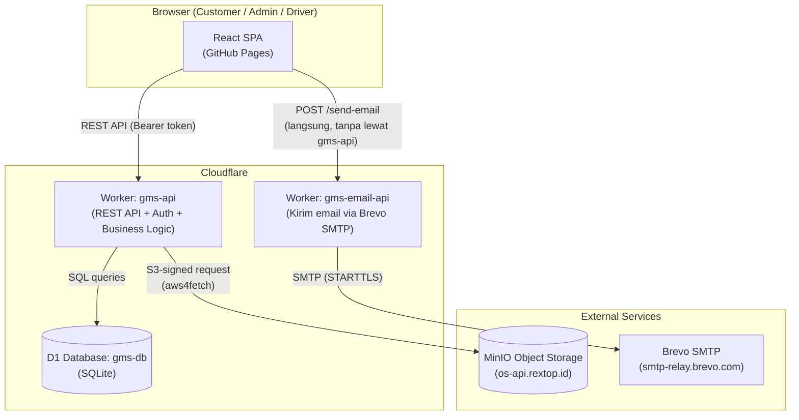
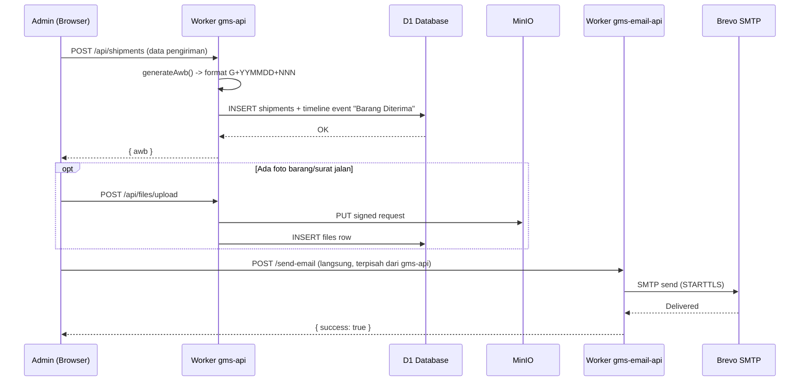
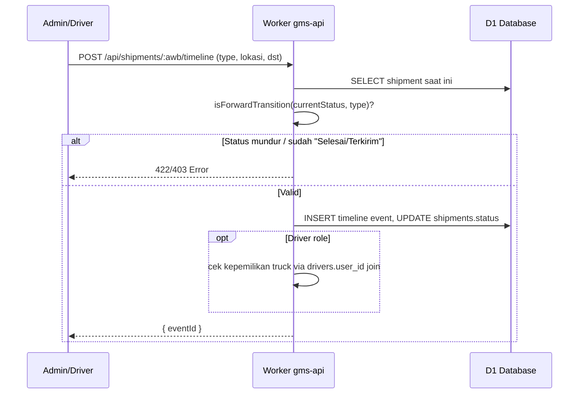
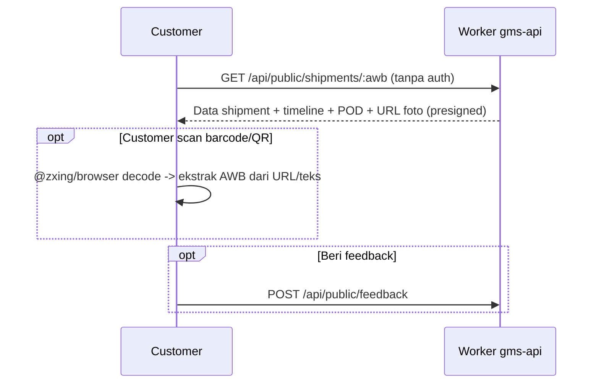
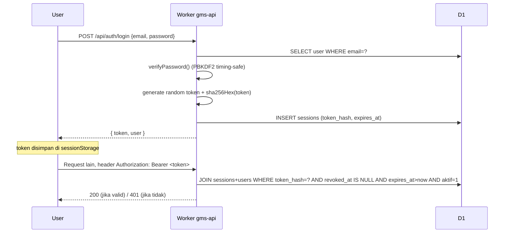
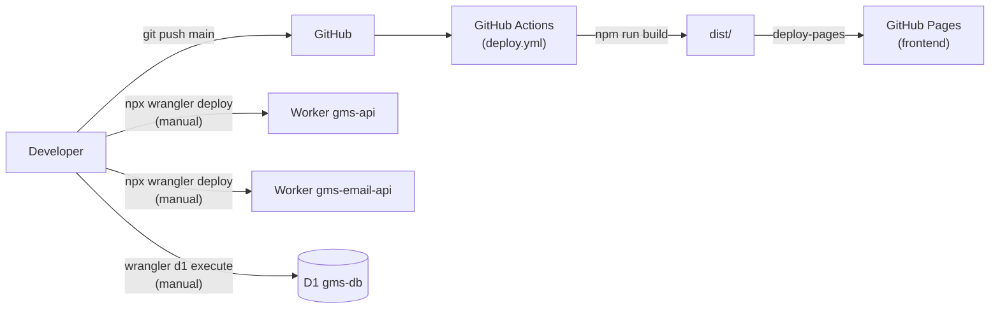

# Sistem Tracking & Resi Digital AWB — PT Gangsar Mitra Sautama

Aplikasi web untuk menerbitkan resi (AWB/Air Waybill) digital, mencatat perjalanan pengiriman barang antar kota, dan menyediakan halaman tracking publik untuk customer — dilengkapi portal admin internal dan portal driver terpisah.

> Dokumentasi ini ditulis berdasarkan hasil audit langsung terhadap source code repository ini (frontend, dua Cloudflare Worker, dan seluruh migrasi database), bukan asumsi. Bagian yang tidak dapat dipastikan dari source code ditandai secara eksplisit.

---

## Daftar Isi

1. [Overview](#1-overview)
2. [Key Features](#2-key-features)
3. [Tech Stack](#3-tech-stack)
4. [System Architecture](#4-system-architecture)
5. [Project Structure](#5-project-structure)
6. [Application Flow](#6-application-flow)
7. [User Flow](#7-user-flow)
8. [Authentication & Authorization](#8-authentication--authorization)
9. [API Documentation](#9-api-documentation)
10. [Database](#10-database)
11. [Main Business Logic](#11-main-business-logic)
12. [External API / Third-Party Integration](#12-external-api--third-party-integration)
13. [Environment Variables](#13-environment-variables)
14. [Local Development](#14-local-development)
15. [Build](#15-build)
16. [Docker](#16-docker)
17. [Deployment](#17-deployment)
18. [CI/CD](#18-cicd)
19. [Monitoring & Logging](#19-monitoring--logging)
20. [Security](#20-security)
21. [Error Handling](#21-error-handling)
22. [Scheduled Jobs / Queue / Worker](#22-scheduled-jobs--queue--worker)
23. [File Storage](#23-file-storage)
24. [Configuration](#24-configuration)
25. [Troubleshooting](#25-troubleshooting)
26. [Development Guidelines](#26-development-guidelines)
27. [Testing](#27-testing)
28. [Important Files](#28-important-files)
29. [Developer Onboarding](#29-developer-onboarding)
30. [End-to-End Application Flow](#30-end-to-end-application-flow)
31. [Glossary](#31-glossary)
32. [Known Limitations](#32-known-limitations)
33. [Future Improvement](#33-future-improvement)
34. [Documentation Notes](#34-documentation-notes)

---

## 1. Overview

**Apa project ini?**
Sebuah sistem tracking pengiriman logistik antar kota untuk **PT Gangsar Mitra Sautama**. Admin membuat resi (AWB), menugaskan unit truck & driver, lalu mencatat progres perjalanan (Berangkat → Transit → Dalam Perjalanan → Tiba di Tujuan → Selesai/Terkirim) — customer bisa melacak statusnya secara publik lewat nomor AWB tanpa perlu login.

**Masalah yang diselesaikan**
Sebelumnya proses tracking pengiriman dilakukan manual (customer harus menghubungi CS untuk tahu posisi barang). Sistem ini memberi:
- Nomor resi digital yang bisa dilacak publik kapan saja.
- Catatan riwayat perjalanan (timeline) yang terstruktur per event, termasuk bukti foto.
- Estimasi tanggal tiba (ETA) otomatis berdasarkan target hari pengiriman.
- Notifikasi email otomatis ke customer saat resi terbit, terjadi kendala, atau selesai.
- Portal terpisah untuk driver agar mereka bisa update status langsung dari lapangan (HP), termasuk mekanisme "ambil pesanan" untuk unit yang belum ditugaskan.

**Target user**
- **Admin internal** (Superadmin/Admin/Viewer) — mengelola data pengiriman, armada, lokasi, user, dan pengaturan sistem.
- **Driver** — melihat pengiriman yang ditugaskan, update status perjalanan, upload bukti foto, dan mengambil pesanan terbuka.
- **Customer/publik** — melacak status pengiriman via nomor AWB tanpa login, memberi feedback/rating.

**Fungsi utama**: penerbitan AWB, update tracking timeline, proof-of-delivery (POD) dengan foto, manajemen armada (truck & driver), manajemen lokasi/titik transit, notifikasi email, audit log, manajemen user & role, estimasi ongkir (kalkulator sisi klien), dan feedback pelanggan.

**Gambaran umum cara kerja**: frontend React (SPA) berbicara langsung ke Cloudflare Worker (`gms-api`) via REST API yang menyimpan data di Cloudflare D1 (SQLite serverless). Foto disimpan di object storage MinIO (S3-compatible), diakses via presigned URL yang di-generate oleh Worker. Pengiriman email transaksional ditangani oleh Worker terpisah (`gms-email-api`) yang memanggil Brevo SMTP.

---

## 2. Key Features

Berdasarkan source code yang ditemukan:

- **Autentikasi & Role-Based Access Control** — 4 role: Superadmin, Admin, Driver, Viewer.
- **Manajemen Pengiriman (AWB)** — buat resi, edit data pengiriman, bulk import via Excel/CSV.
- **Update Tracking / Timeline** — pipeline status yang tidak bisa mundur, dengan lokasi bebas ketik + autocomplete.
- **Proof of Delivery (POD)** — foto barang diterima (wajib, tampil ke customer) + foto surat jalan (opsional, internal-only), dengan window edit 30 hari.
- **Estimasi Tiba (ETA) Otomatis** — admin input target hari kerja, sistem hitung tanggal tiba otomatis (bukan input manual).
- **Portal Driver terpisah** (`/driver/*`) — dashboard khusus driver, laporan posisi GPS manual, scan AWB (barcode/QR) untuk klaim pengiriman terbuka.
- **Workflow Klaim Pengiriman Terbuka** — pengiriman tanpa truck bisa "diambil" driver, dikonfirmasi/ditolak admin.
- **Manajemen Armada (Truck & Driver)** — data truck, driver, riwayat perjalanan per unit.
- **Manajemen Lokasi/Titik Transit** — master data kota/gudang/hub untuk lokasi timeline.
- **Manajemen User** — CRUD user dengan pembatasan privilege per role (lihat [§8](#8-authentication--authorization)).
- **Notifikasi Email** — otomatis saat AWB dibuat, kendala, dan selesai (via Worker email terpisah + Brevo SMTP).
- **Notification Center internal** — daftar notifikasi/email yang terkirim, dengan status baca (unread badge).
- **Audit Log** — pencatatan setiap aksi penting (login, create/update AWB, ubah user, dll).
- **Deteksi Pengiriman Macet (Stagnant Shipment)** — highlight AWB tanpa update dalam N hari (threshold dikonfigurasi via Settings).
- **Feedback Customer** — rating & komentar per AWB dari halaman tracking publik.
- **Kalkulator Estimasi Ongkir** — estimasi biaya kirim sisi klien (bukan tarif resmi, lihat komentar di source).
- **Export Data** — export data pengiriman ke CSV.
- **Cetak Resi / Email Preview** — tampilan resi cetak dan preview email sebelum kirim.
- **Multi-bahasa (ID/EN)** — via `LanguageContext` + `translations.ts`.
- **Barcode/QR Scanner** — scan AWB untuk pencarian tracking maupun klaim pengiriman (kamera device, `@zxing/browser`).

---

## 3. Tech Stack

| Layer | Technology | Version | Purpose |
|---|---|---|---|
| Frontend Framework | React | ^19.2.8 | UI SPA |
| Frontend Build Tool | Vite | ^8.3.0 | Dev server & bundler |
| Bahasa | TypeScript | ~6.0.2 (frontend), ~5.7.2 (Workers) | Type safety |
| Styling | Tailwind CSS | ^4.3.3 | Utility-first CSS |
| Routing | react-router-dom | ^7.18.3 | Client-side routing |
| Backend (API) | Cloudflare Workers | N/A (runtime) | Serverless backend `gms-api` |
| Backend (Email) | Cloudflare Workers | N/A (runtime) | Worker terpisah `gms-email-api` |
| Database | Cloudflare D1 (SQLite) | N/A | Data pengiriman, user, dll |
| Object Storage | MinIO (S3-compatible) | N/A | Foto (barang, surat jalan, POD, avatar) |
| Storage Client | aws4fetch | ^1.0.20 | Signing request S3 di Worker |
| Email SMTP | Brevo (via `worker-mailer` ^1.2.1 / `nodemailer` ^10.0.6 dev) | N/A | Kirim email transaksional |
| Auth | Custom session token (PBKDF2 + SHA-256) | N/A | Lihat [§8](#8-authentication--authorization) |
| Barcode Scanner | @zxing/browser | ^0.2.1 | Scan AWB dari kamera |
| QR Code | qrcode.react | ^4.2.0 | Generate QR tracking di resi |
| Excel Import | read-excel-file | ^9.3.10 | Bulk import pengiriman/armada/lokasi |
| Icon | lucide-react | ^1.45.0 | Icon set UI |
| Linter | oxlint | ^1.81.0 | Linting (JS/TS/React rules) |
| Hosting Frontend | GitHub Pages | N/A | Static hosting hasil `vite build` |
| Hosting Backend | Cloudflare Workers | N/A | `gms-api` & `gms-email-api` |
| CI/CD | GitHub Actions | N/A | Deploy frontend ke GitHub Pages saja |
| Container | — | — | **Tidak ditemukan** (tidak ada Docker) |
| Web Server | — | — | **Tidak ditemukan** (static hosting, bukan server tradisional) |

---

## 4. System Architecture

Repository ini berisi **tiga bagian yang deploy terpisah**: 1 frontend statis + 2 Cloudflare Worker independen.



**Catatan penting arsitektur:**
- Frontend **tidak** melewati `gms-api` untuk mengirim email — `src/utils/sendEmail.ts` memanggil `gms-email-api` secara langsung.
- URL backend (`gms-api` dan `gms-email-api`) **di-hardcode** di source frontend (`src/utils/apiClient.ts`, `src/utils/sendEmail.ts`), bukan lewat environment variable saat build. Lihat [§32 Known Limitations](#32-known-limitations).
- Tidak ada API gateway/reverse proxy tambahan — Worker langsung menangani CORS dan routing sendiri (router custom, lihat [§5](#5-project-structure)).
- Saat development lokal (`vite dev`), ada middleware Vite (`server/emailApiPlugin.ts`) yang mereplikasi endpoint email secara lokal via `nodemailer`, supaya tidak perlu deploy Worker email untuk testing lokal.

---

## 5. Project Structure

```text
/data/GMS
├── src/                        # Frontend React app
│   ├── pages/
│   │   ├── admin/               # 16 halaman portal admin
│   │   ├── driver/               # 3 halaman portal driver
│   │   └── public/               # 6 halaman publik (tracking, home, dll)
│   ├── components/               # Komponen UI reusable
│   │   └── layout/                # AdminLayout, DriverLayout, PublicLayout, NotificationBell
│   ├── store/                    # 10 React Context (state management, tanpa Redux/Zustand)
│   ├── utils/                    # Helper: apiClient, format, sla, status, dll
│   └── data/                     # translations.ts, ongkirData.ts (data statis)
├── api-worker/                  # Backend utama (Cloudflare Worker: gms-api)
│   ├── src/
│   │   ├── routes/               # 13 modul route (auth, users, shipments, driver, dll)
│   │   ├── index.ts              # Entry point, router dispatch, CORS, logging
│   │   ├── router.ts             # Router custom (bukan library)
│   │   ├── authMiddleware.ts     # requireAuth / requirePermission
│   │   ├── rbac.ts               # Permission table per role
│   │   ├── crypto.ts             # Password hashing & session token
│   │   ├── status.ts             # State machine status pengiriman
│   │   ├── sla.ts                # Kalkulasi ETA (hari kerja)
│   │   ├── awb.ts                # Generator nomor AWB
│   │   ├── storage.ts            # Integrasi MinIO (upload/presign)
│   │   └── http.ts               # Response wrapper & error types
│   ├── migrations/               # 6 file SQL migration (schema + 1 data migration)
│   └── wrangler.toml             # Config deploy Worker (D1 binding, env vars, secrets)
├── cloudflare-worker/            # Backend email (Cloudflare Worker: gms-email-api)
│   ├── src/index.ts              # Kirim email via worker-mailer (Brevo SMTP)
│   └── wrangler.toml
├── server/                       # Middleware Vite dev-only (mereplikasi email API lokal)
│   ├── emailApiPlugin.ts
│   └── emailTemplate.ts          # Dipakai bersama oleh dev server & cloudflare-worker
├── public/                       # Static assets + 404.html (SPA fallback GitHub Pages)
├── .github/workflows/deploy.yml  # CI/CD: build & deploy frontend ke GitHub Pages
├── vite.config.ts
└── package.json
```

### Fungsi Folder/File Penting

| Path | Deskripsi |
|---|---|
| `src/App.tsx` | Definisi seluruh route + provider nesting |
| `src/utils/apiClient.ts` | Wrapper `fetch` ke `gms-api`, menyimpan token di `sessionStorage` |
| `src/store/*Context.tsx` | State management per domain (Auth, Shipment, Fleet, Location, dll) — pola: `createContext` + `Provider` + `useX()` hook, memanggil REST API langsung |
| `api-worker/src/index.ts` | Entry Worker: parsing auth, dispatch router, CORS, logging terstruktur |
| `api-worker/src/routes/*.ts` | Satu file per domain fitur (shipments, driver, users, dll), masing-masing mendaftarkan endpoint via `registerXRoutes(router)` |
| `api-worker/src/rbac.ts` | Definisi permission per role — sumber kebenaran RBAC |
| `api-worker/migrations/*.sql` | Riwayat perubahan schema database (dijalankan manual, lihat [§14](#14-local-development)) |
| `cloudflare-worker/src/index.ts` | Worker terpisah khusus kirim email (tidak berbagi kode dengan `gms-api`) |

---

## 6. Application Flow

### Flow: Membuat Pengiriman Baru & Kirim Notifikasi



### Flow: Update Tracking (Admin atau Driver)



### Flow: Tracking Publik (Tanpa Login)



---

## 7. User Flow

### Admin / Superadmin Flow

```text
Login (/admin/login)
  ↓
Dashboard (statistik, AWB macet)
  ↓
Buat Pengiriman  ATAU  Data Pengiriman (list/ringkas/detail)
  ↓
Update Tracking (status, lokasi, foto)  →  Timeline publik ter-update
  ↓
(Opsional) Kirim Email / Cetak Resi
  ↓
Kelola Armada, Lokasi, User, Settings, Audit Log
```

### Driver Flow

```text
Login (/driver/login) — hanya role Driver, ditolak di /admin/login
  ↓
Dashboard Driver (unit truck, pengiriman aktif/selesai/kendala/terbuka)
  ↓
Pilih AWB yang ditugaskan  ATAU  Scan AWB / klik "Ambil" di Pesanan Terbuka
  ↓
Update status + upload foto (kamera/upload) + lapor posisi GPS manual
  ↓
Jika status "Selesai/Terkirim": wajib foto bukti + nama penerima
```

### Customer (Publik) Flow

```text
Buka /tracking  →  Input nomor AWB (atau scan barcode/QR)
  ↓
Lihat status, timeline perjalanan, ETA, foto bukti (jika ada)
  ↓
(Opsional) Beri feedback/rating
```

---

## 8. Authentication & Authorization

### Mekanisme Login

1. `POST /api/auth/login` (`email`, `password`) — dibatasi rate limit **8 percobaan / 10 menit** per `IP:email` (in-memory `Map`, lihat [§32](#32-known-limitations)).
2. Password diverifikasi terhadap `password_hash` (PBKDF2-SHA256, 100.000 iterasi, salt 16 byte, timing-safe compare).
3. Jika valid & `aktif = 1`: server membuat token random 32-byte (base64url), menyimpan **hash SHA-256 dari token** di tabel `sessions` (raw token tidak pernah disimpan di database), lalu mengembalikan raw token ke client sekali saja.
4. Client menyimpan token di **`sessionStorage`** (bukan `localStorage`) — hilang saat tab ditutup, tidak dibagi antar tab.
5. Setiap request berikutnya mengirim header `Authorization: Bearer <token>`.

### Otorisasi (RBAC)

Permission didefinisikan di `api-worker/src/rbac.ts`. 4 role, 15 jenis permission:

`users.manage`, `shipments.view`, `shipments.create`, `shipments.update_info`, `tracking.update`, `fleet.view`, `fleet.manage`, `locations.view`, `locations.manage`, `feedback.view`, `notifications.view`, `audit.view`, `settings.view`, `settings.manage`, `files.upload`.

| Role | Permission Set (dari rbac.ts) |
|---|---|
| **Superadmin** | Seluruh 15 permission |
| **Admin** | Seluruh 15 permission (sama dengan Superadmin di level RBAC) — **tapi** ada pembatasan tambahan di level route handler untuk `users.manage` (lihat catatan di bawah) |
| **Driver** | `shipments.view`, `tracking.update`, `fleet.view`, `locations.view`, `feedback.view`, `notifications.view`, `files.upload` — dibatasi lebih lanjut ke "pengiriman miliknya saja" via join `drivers.user_id` di setiap query |
| **Viewer** | `shipments.view`, `fleet.view`, `locations.view`, `feedback.view`, `notifications.view`, `settings.view` — read-only, tidak ada permission create/update/manage |

> **Penting:** Tabel RBAC di atas **tidak menceritakan seluruh cerita akses**. Beberapa pembatasan ditegakkan secara ad hoc di dalam route handler, bukan di tabel permission:
> - `routes/users.ts`: meskipun Admin punya `users.manage`, Admin **tidak bisa** membuat user ber-role Admin, menaikkan role user lain jadi Admin, atau mengubah/menonaktifkan akun Admin lain — hanya Superadmin yang bisa.
> - Baris user dengan `role = "Superadmin"` **tidak bisa diubah oleh siapa pun** (termasuk Superadmin sendiri) lewat `PATCH /api/users/:id` — ini hard-blocked di kode.
> - `routes/driver.ts`: setiap endpoint driver memvalidasi ulang kepemilikan data (join `drivers.user_id`/`trucks.driver_id`) secara independen, tidak hanya mengandalkan role check.

### Guard di Frontend

Route React dibungkus komponen guard (`src/components/RequireAuth.tsx`):

| Guard | Siapa yang boleh |
|---|---|
| `RequireAuth` | Semua role terautentikasi kecuali Driver (Driver diarahkan ke `/driver`) |
| `RequireAdmin` | Superadmin & Admin |
| `RequireTrackingUpdater` | Semua role kecuali Viewer |
| `RequireDriver` | Hanya Driver, portal terpisah (`/driver/*`) |
| `RequireSuperadmin` | Hanya Superadmin — **saat ini tidak dipakai route manapun**, disiapkan untuk kebutuhan masa depan |

Guard di frontend **hanya untuk UX** (menyembunyikan tombol/redirect) — validasi sebenarnya selalu ditegakkan ulang di backend (`requirePermission`).

### Session Management

- **TTL**: `SESSION_TTL_HOURS` env var (saat ini `24` jam).
- **Logout** (`POST /api/auth/logout`): merevoke *satu* token yang sedang dipakai saja.
- **Ganti password** (`POST /api/auth/change-password`): merevoke **semua** sesi aktif lain milik user tersebut (paksa re-login di device lain).
- **Refresh token**: **Tidak ditemukan** — tidak ada mekanisme refresh, sesi murni expire berdasarkan TTL.



---

## 9. API Documentation

Base URL: `https://gms-api.indotrans-tracking.workers.dev` (hardcoded di frontend, lihat [§32](#32-known-limitations)). Semua response memakai shape seragam — lihat [§21 Error Handling](#21-error-handling).

### Auth (`routes/auth.ts`)

| Method | Endpoint | Auth | Description |
|---|---|---|---|
| POST | `/api/auth/login` | Publik (rate-limited) | Login, mengembalikan token |
| POST | `/api/auth/logout` | `requireAuth` | Revoke token aktif |
| GET | `/api/auth/me` | `requireAuth` | Ambil profil user login |
| PATCH | `/api/auth/me` | `requireAuth` | Update profil sendiri |
| POST | `/api/auth/change-password` | `requireAuth` | Ganti password, revoke sesi lain |

### Users & Drivers (`routes/users.ts`)

| Method | Endpoint | Permission | Description |
|---|---|---|---|
| GET | `/api/drivers` | `users.manage` | List data driver (master data) + status tautan akun login |
| GET | `/api/users` | `users.manage` | List semua user |
| POST | `/api/users` | `users.manage` | Buat user (dibatasi role, lihat [§8](#8-authentication--authorization)) |
| PATCH | `/api/users/:id` | `users.manage` | Update user (dibatasi role) |

### Shipments (`routes/shipments.ts`)

| Method | Endpoint | Permission | Description |
|---|---|---|---|
| GET | `/api/shipments` | `shipments.view` | List pengiriman (search, filter status) |
| POST | `/api/shipments` | `shipments.create` | Buat AWB baru |
| GET | `/api/shipments/:awb` | `shipments.view` | Detail + timeline + POD + file |
| PATCH | `/api/shipments/:awb` | `shipments.update_info` | Update data pengirim/penerima/rute/SLA |
| POST | `/api/shipments/:awb/timeline` | `tracking.update` | Tambah event timeline / ubah status |
| PATCH | `/api/shipments/:awb/pod-photo` | `tracking.update` | Ganti foto POD (window 30 hari) |
| GET | `/api/shipments/claims/pending` | `shipments.update_info` | List klaim pengiriman terbuka yang menunggu konfirmasi |
| POST | `/api/shipments/:awb/claim/confirm` | `shipments.update_info` | Konfirmasi klaim driver → assign truck |
| POST | `/api/shipments/:awb/claim/reject` | `shipments.update_info` | Tolak klaim driver |
| POST | `/api/shipments/:awb/unassign` | `shipments.update_info` | Batalkan penugasan driver (kembali ke pool terbuka) |

### Driver Portal (`routes/driver.ts`)

Semua endpoint di bawah divalidasi lewat `requireAuth` + `requireDriverId()` (memastikan role Driver dan akun tertaut ke `drivers.user_id`).

| Method | Endpoint | Description |
|---|---|---|
| GET | `/api/driver/trucks` | Unit truck yang ditugaskan ke driver login |
| GET | `/api/driver/shipments` | Pengiriman yang ditugaskan ke driver ini |
| GET | `/api/driver/open-shipments` | Pengiriman terbuka (belum ada truck) yang bisa diklaim |
| POST | `/api/driver/shipments/:awb/claim` | Ajukan klaim pengiriman terbuka |
| POST | `/api/driver/shipments/:awb/claim/cancel` | Batalkan klaim sendiri |
| GET | `/api/driver/shipments/:awb` | Detail pengiriman (khusus milik sendiri) |
| POST | `/api/driver/shipments/:awb/position` | Lapor posisi GPS manual |
| GET | `/api/driver/shipments/:awb/position` | Posisi terakhir yang dilaporkan |

### Fleet / Trucks (`routes/trucks.ts`)

| Method | Endpoint | Permission | Description |
|---|---|---|---|
| GET | `/api/trucks` | `fleet.view` | List truck + info driver |
| POST | `/api/trucks` | `fleet.manage` | Tambah truck (sekaligus buat data driver baru) |
| PATCH | `/api/trucks/:id` | `fleet.manage` | Update truck/nama-telepon driver |
| GET | `/api/trucks/:id/history` | `fleet.view` | Riwayat pengiriman per unit |

### Locations (`routes/locations.ts`)

| Method | Endpoint | Permission | Description |
|---|---|---|---|
| GET | `/api/locations` | `locations.view` | List titik lokasi |
| POST | `/api/locations` | `locations.manage` | Tambah lokasi |
| PATCH | `/api/locations/:id` | `locations.manage` | Update lokasi |
| DELETE | `/api/locations/:id` | `locations.manage` | Hapus lokasi |

### Files (`routes/files.ts`)

| Method | Endpoint | Auth | Description |
|---|---|---|---|
| POST | `/api/files/upload` | `files.upload` | Upload foto ke MinIO |
| GET | `/api/files/:id` | `requireAuth` (role apapun) | Resolve presigned view URL |
| DELETE | `/api/files/:id` | `files.upload` | Hapus file |

### Notifications, Feedback, Audit, Settings, Dashboard

| Method | Endpoint | Permission | Description |
|---|---|---|---|
| GET | `/api/notifications` | `notifications.view` | List notifikasi/email terkirim |
| POST | `/api/notifications/read-all` | `notifications.view` | Tandai semua notifikasi terbaca |
| GET | `/api/feedback` | `feedback.view` | List feedback customer |
| GET | `/api/audit-logs` | `audit.view` | List audit log |
| GET | `/api/settings` | `settings.view` | Ambil pengaturan sistem |
| PATCH | `/api/settings` | `settings.manage` | Ubah pengaturan sistem |
| GET | `/api/dashboard/stats` | `shipments.view` | Statistik dashboard |

### Public (Tanpa Auth) (`routes/public.ts`)

| Method | Endpoint | Description |
|---|---|---|
| GET | `/api/public/shipments/:awb` | Tracking publik |
| GET | `/api/public/locations` | List lokasi aktif (untuk form publik) |
| POST | `/api/public/feedback` | Kirim feedback |
| GET | `/api/public/files/:id` | Resolve file publik (whitelist tipe entity tertentu saja — tidak termasuk `user_avatar`) |

### Health

| Method | Endpoint | Description |
|---|---|---|
| GET | `/api/health` | Health check, tanpa auth |

### Email Worker (`gms-email-api`, terpisah)

| Method | Endpoint | Description |
|---|---|---|
| POST | `/send-email` | Kirim email transaksional via Brevo SMTP |

---

## 10. Database

**Engine**: Cloudflare D1 (SQLite). Skema final setelah 6 migrasi (`api-worker/migrations/0001`–`0006`).

```mermaid
erDiagram
    USERS ||--o{ SESSIONS : has
    USERS ||--o| DRIVERS : "linked via user_id"
    DRIVERS ||--o{ TRUCKS : assigned
    TRUCKS ||--o{ SHIPMENTS : hauls
    SHIPMENTS ||--o{ SHIPMENT_TIMELINE_EVENTS : has
    SHIPMENTS ||--o| SHIPMENT_POD : "has (1:1)"
    SHIPMENTS ||--o{ NOTIFICATIONS : triggers
    SHIPMENTS ||--o| FEEDBACK : "has (1:1)"
    SHIPMENTS ||--o{ DRIVER_POSITION_REPORTS : tracked
    LOCATIONS ||--o{ SHIPMENT_TIMELINE_EVENTS : "referenced as titik_id"
    USERS ||--o{ AUDIT_LOG : performs
    USERS ||--o{ FILES : uploads
    DRIVERS ||--o{ SHIPMENTS : "claim_driver_id (pending claim)"

    USERS {
        text id PK
        text email UK
        text password_hash
        text role
        int aktif
    }
    DRIVERS {
        text id PK
        text nama
        text telepon
        text user_id FK "UNIQUE, nullable"
    }
    TRUCKS {
        text id PK
        text nomor_unit UK
        text driver_id FK
        text status
    }
    SHIPMENTS {
        text awb PK
        text status
        text truck_id FK
        real sla_value
        text estimasi_tiba
        text claim_status
        text claim_driver_id FK
    }
    SHIPMENT_TIMELINE_EVENTS {
        text id PK
        text awb FK
        int seq
        text type
        text titik_id FK
        text truck_id FK
    }
    SHIPMENT_POD {
        text awb PK_FK
        text nama_penerima
        text delivered_at
    }
    NOTIFICATIONS {
        text id PK
        text awb FK
        text trigger_type
        int is_read
    }
    FEEDBACK {
        text id PK
        text awb FK "UNIQUE"
        int rating
    }
    AUDIT_LOG {
        text id PK
        text user_id FK
        text awb "no FK constraint"
        text action
    }
    FILES {
        text id PK
        text uploaded_by FK
        text entity_type
        text entity_id "polymorphic, no FK"
    }
    DRIVER_POSITION_REPORTS {
        text id PK
        text awb FK
        text driver_user_id FK
        real latitude
        real longitude
    }
    LOCATIONS {
        text id PK
        text nama_kota
        text jenis
    }
```

### Detail Tabel

**`users`** — akun login internal.
`id`(PK) · `nama` · `email`(UNIQUE) · `password_hash` · `role` (CHECK: Superadmin/Admin/Driver/Viewer) · `aktif`(default 1) · `foto_file_id` · `last_login_at` · `created_at`/`updated_at` · `created_by`/`updated_by`.

**`sessions`** — sesi login aktif.
`id`(PK) · `user_id`(FK users) · `token_hash`(UNIQUE) · `created_at`/`expires_at` · `revoked_at` · `user_agent` · `ip`.

**`locations`** — master data kota/titik transit.
`id`(PK) · `nama_kota`/`kode_kota`/`provinsi` · `jenis` (CHECK: Gudang/Hub/Transit/Cabang/Tujuan) · `aktif`.

**`drivers`** — master data driver (terpisah dari `users`, ditautkan via `user_id`).
`id`(PK) · `nama` · `telepon` · `user_id`(FK users, **UNIQUE**, nullable — added migrasi 0002).

**`trucks`** — master data armada.
`id`(PK) · `nomor_unit`(UNIQUE) · `jenis` · `kapasitas` · `driver_id`(FK drivers, **tanpa unique constraint** — secara teori bisa >1 truck per driver) · `status` (CHECK: Available/On Trip/Maintenance/Inactive).

**`shipments`** — entitas inti, keyed langsung oleh nomor AWB (bukan UUID terpisah).
`awb`(PK) · `tanggal_dibuat`/`jam_dibuat` · `status` (CHECK 7 nilai, lihat [§11](#11-main-business-logic)) · data pengirim/penerima (nama/telepon/email) · alamat & kota asal/tujuan · `deskripsi_barang` · `layanan` (CHECK: Darat/Express/Kargo/Regular/Charter) · `berat_kg` · `jumlah_koli` · `truck_id`(FK trucks) · `email_terkirim` · `estimasi_tiba` · `sla_value`/`sla_unit` (migrasi 0003) · `claim_status`/`claim_driver_id`/`claim_requested_at` (migrasi 0004).

**`shipment_timeline_events`** — riwayat perjalanan per AWB.
`id`(PK) · `awb`(FK shipments) · `seq` · `type` · `lokasi` · `titik_id`(FK locations) · `tanggal`/`jam` · `keterangan` · `truck_id`/`truck_sebelumnya_id`(FK trucks) · `input_by_user_id`(FK users) · `input_at`.

**`shipment_pod`** — bukti serah terima, relasi 1:1 dengan shipment.
`awb`(PK **dan** FK shipments) · `nama_penerima` · `catatan` · `delivered_at`/`updated_at`.

**`notifications`** — log email yang terkirim ke customer.
`id`(PK) · `awb`(FK shipments) · `trigger_type` (CHECK: AWB_CREATED/KENDALA/SELESAI) · `to_email`/`to_name` · `recipient_role` (CHECK: penerima/pengirim) · `is_read`/`read_at` (migrasi 0006).

**`feedback`** — rating dari customer, maksimal 1 per AWB (UNIQUE index).
`id`(PK) · `awb`(FK shipments, UNIQUE) · `customer_name` · `rating` (CHECK 1–5) · `comment`.

**`audit_log`** — jejak audit aksi admin/driver.
`id`(PK) · `user_id`(FK users) · `user_name`/`role` · `action`/`action_label`/`module` · `awb` (teks bebas, **tanpa FK**) · `description`.

**`settings`** — key-value store pengaturan sistem.
`key`(PK) · `value` · `updated_at`/`updated_by`.

**`files`** — metadata file, isi biner tersimpan di MinIO.
`id`(PK) · `object_key`(UNIQUE) · `filename`/`mime_type`/`size_bytes` · `uploaded_by`(FK users) · `entity_type`/`entity_id` (polimorfik — `entity_id` bisa berisi AWB, id timeline event, atau id user, tergantung `entity_type`; **tanpa FK constraint** karena sifatnya generik).

**`driver_position_reports`** (migrasi 0002) — laporan posisi GPS manual dari driver.
`id`(PK) · `awb`(FK shipments) · `driver_user_id`(FK users) · `latitude`/`longitude`/`accuracy` · `created_at`.

> **Migrasi 0005** bukan perubahan schema, melainkan migrasi data satu kali: mengganti format seluruh AWB lama (`GMS<YYMMDD>-<NNN>`) ke format baru (`G<YYMMDD><NNN>`) di semua tabel yang mereferensikannya.

---

## 11. Main Business Logic

### Process: State Machine Status Pengiriman

**Purpose**: mencegah status pengiriman "mundur" (misal dari "Tiba di Tujuan" balik ke "Berangkat").

**Flow**
```text
Dalam Persiapan (rank 0)
 ↓
Berangkat (rank 1)
 ↓
Transit / Dalam Perjalanan / Kendala / Transfer Unit (rank 2, sama level — bisa bergantian)
 ↓
Tiba di Tujuan (rank 3)
 ↓
Selesai / Terkirim (rank 4, terkunci — tidak bisa diubah lagi)
```

**Related Components**: `api-worker/src/status.ts` (`isForwardTransition`, `getPipelineRank`), dipanggil dari `POST /api/shipments/:awb/timeline`. Frontend (`src/utils/status.ts`) meniru rank table ini hanya untuk memfilter opsi dropdown UI — penegakan sebenarnya selalu di backend.

**Important Rules**
- Event dengan rank lebih rendah dari status saat ini akan ditolak (403/422).
- Shipment dengan status `"Selesai / Terkirim"` terkunci total — tidak bisa ditambah event apa pun lagi.
- Role Driver hanya bisa update timeline untuk AWB yang truck-nya terhubung ke `drivers.user_id` miliknya sendiri (divalidasi ulang di backend, bukan cuma UI).

### Process: Estimasi Tiba (ETA) Otomatis

**Purpose**: memberi customer perkiraan tanggal barang sampai, tanpa admin perlu isi tanggal manual (rawan salah).

**Flow**
```text
Admin isi "Target Pengiriman (Hari)" saat buat/edit AWB
 ↓
Backend hitung addBusinessDays(tanggal_dibuat, sla_value)
 ↓
Lewati hari Sabtu & Minggu (belum ada kalender hari libur nasional)
 ↓
Simpan ke shipments.estimasi_tiba
 ↓
Tampil di halaman tracking publik & detail admin
```

**Related Components**: `api-worker/src/sla.ts`, dipanggil dari `POST /api/shipments` dan `PATCH /api/shipments/:awb`.

**Important Rules**
- ETA **selalu** dihitung server-side — tidak pernah diterima sebagai input langsung dari client.
- Jika `sla_value` tidak diisi, `estimasi_tiba` tetap `null` — publik akan melihat "Belum tersedia", **tidak pernah tanggal palsu**.
- Melewati tanggal ETA hanya menampilkan badge peringatan visual di tracking publik — **tidak pernah otomatis mengubah `status`** pengiriman.

### Process: Generate Nomor AWB

**Purpose**: identifier unik, mudah dibaca, terurut per tanggal.

**Flow**
```text
Format: G + YYMMDD (UTC) + NNN (sequence 3 digit per hari)
Contoh: G260927001
 ↓
Query MAX sequence existing hari itu via LIKE prefix
 ↓
next = max + 1 (atau 1 jika belum ada)
```

**Related Components**: `api-worker/src/awb.ts`, dipanggil dari `POST /api/shipments`.

**Important Rules**
- **Tidak ada locking/counter table** — ada celah race condition teoritis jika 2 request create AWB persis bersamaan di detik yang sama (tidak ditangani khusus di kode).
- Format lama (`GMS<YYMMDD>-<NNN>`) sudah dimigrasikan penuh ke format baru via migrasi data 0005.

### Process: Workflow Klaim Pengiriman Terbuka

**Purpose**: memungkinkan pengiriman tanpa truck (belum ditugaskan) untuk "diambil" driver mana pun, dengan persetujuan admin — berguna saat driver reguler berhalangan.

**Flow**
```text
Admin buat AWB tanpa pilih truck (truck_id = NULL)
 ↓
Driver manapun lihat di "Pesanan Terbuka" (GET /api/driver/open-shipments)
 ↓
Driver klik "Ambil" atau scan barcode AWB
 ↓
POST /api/driver/shipments/:awb/claim -> claim_status = 'pending'
 ↓
Admin lihat di panel "Klaim Menunggu Konfirmasi" (Data Pengiriman / Detail Resi)
 ↓
Admin Confirm -> truck_id = truck milik driver tsb, claim_status = NULL
   ATAU
Admin Reject -> kembali ke pool terbuka
```

**Related Components**: `routes/driver.ts` (claim/cancel), `routes/shipments.ts` (claims/pending, confirm, reject, unassign).

**Important Rules**
- Klaim yang sudah dikonfirmasi (truck sudah ter-assign) hanya bisa dibatalkan (`unassign`) selama status masih `"Dalam Persiapan"` — mencegah driver "dicabut" saat sudah di jalan.
- Insert baris shipment baru (via INSERT ... SELECT) dipakai saat migrasi AWB tepatnya untuk menghindari pelanggaran FK constraint saat rename PK — pola yang sama relevan dipahami saat menyentuh tabel `shipments`.

### Process: Proof of Delivery (POD)

**Purpose**: bukti serah terima yang sah secara visual, dengan pemisahan tegas data internal vs publik.

**Flow**
```text
Driver ubah status ke "Selesai / Terkirim"
 ↓
Wajib isi nama penerima + foto barang diterima
 ↓
Opsional: foto surat jalan (internal-only)
 ↓
INSERT shipment_pod + files (pod_barang, pod_surat_jalan)
 ↓
Tracking publik hanya render foto "pod_barang" -- TIDAK PERNAH "pod_surat_jalan"
```

**Related Components**: `ProofOfDeliveryCard.tsx` (frontend, publik), `routes/shipments.ts` (`pod-photo`).

**Important Rules**
- Foto POD bisa diganti admin dalam window **30 hari** sejak `delivered_at` (`POD_EDIT_WINDOW_MS`).
- `foto_surat_jalan` secara sengaja **tidak pernah** dikirim ke komponen publik.

### Process: Deteksi Pengiriman Macet (Stagnant)

**Purpose**: bantu admin memantau AWB yang "diam" terlalu lama tanpa update.

**Flow**: threshold hari (default via `settings`) dibandingkan terhadap `tanggal`/`jam` event timeline terakhir tiap shipment yang belum `"Selesai / Terkirim"` — dihitung di frontend (`src/utils/stagnant.ts`), ditampilkan di `StagnantShipmentsCard` (Dashboard) dengan link ke filter `?macet=1` di Data Pengiriman.

---

## 12. External API / Third-Party Integration

| Service | Purpose | Authentication | Used By |
|---|---|---|---|
| **MinIO** (`os-api.rextop.id`) | Object storage untuk foto (barang, surat jalan, POD, avatar user) | Access Key + Secret Key (signed request via `aws4fetch`) | `api-worker/src/storage.ts` (dipanggil dari `routes/files.ts`, `routes/public.ts`) |
| **Brevo SMTP** (`smtp-relay.brevo.com:587`) | Kirim email transaksional (resi terbit, kendala, selesai) | SMTP login + key, STARTTLS | `cloudflare-worker/src/index.ts` (produksi, via `worker-mailer`) & `server/emailApiPlugin.ts` (dev lokal, via `nodemailer`) |

### MinIO — Detail

- **Upload**: client → `POST /api/files/upload` (multipart) → Worker validasi (mime `image/jpeg|png|webp`, maks **8MB**) → Worker sign & `PUT` langsung ke MinIO (bukan presigned-upload yang diberikan ke client) → simpan metadata ke tabel `files`.
- **View**: `GET /api/files/:id` atau `GET /api/public/files/:id` → Worker generate presigned **GET** URL, **expiry 24 jam**. *(Sebelumnya 15 menit — pernah menyebabkan bug broken-image pada tab browser yang lama terbuka; sudah diperbaiki.)*
- Region di-hardcode `us-east-1`, service `s3` (kompatibilitas signing S3 v4 generik untuk MinIO).

### Brevo — Detail

- Dikirim manual oleh admin (klik tombol "Kirim Email" di `CreateShipment.tsx` / `EmailPreview.tsx`), **bukan otomatis** setelah setiap perubahan status.
- Template HTML & subject dibagi bersama antara Worker produksi dan dev-server lewat `server/emailTemplate.ts`.
- Toggle `email_sending_enabled` di Settings **hanya gating di sisi UI** — tidak ada penegakan di server jika endpoint dipanggil langsung. *(Lihat [§32 Known Limitations](#32-known-limitations).)*
- Retry mechanism / timeout khusus: **Tidak ditemukan** di source code.

Tidak ada integrasi payment gateway, maps API, SMS provider, atau analytics/APM pihak ketiga lain yang ditemukan di source code.

---

## 13. Environment Variables

### Frontend (`.env` / `.env.example`, root) — hanya dipakai dev server lokal

| Variable | Purpose | Required | Example |
|---|---|---|---|
| `BREVO_SMTP_HOST` | Host SMTP Brevo | Yes (untuk fitur email di dev lokal) | `smtp-relay.brevo.com` |
| `BREVO_SMTP_PORT` | Port SMTP | Yes | `587` |
| `BREVO_SMTP_LOGIN` | Login SMTP | Yes | `<your-smtp-login>` |
| `BREVO_SMTP_KEY` | API key/password SMTP | Yes | `<REDACTED>` |
| `BREVO_SENDER_EMAIL` | Alamat pengirim | Yes | `noreply@yourdomain.com` |
| `BREVO_SENDER_NAME` | Nama pengirim | Yes | `<your-sender-name>` |
| `BREVO_FROM_NAME` | Nama "from" alternatif | No | `<optional>` |

> Variabel ini **hanya** dipakai `server/emailApiPlugin.ts` saat `vite dev`/`vite preview`. Base URL API utama (`gms-api`) **tidak** dikonfigurasi lewat env var — lihat [§32](#32-known-limitations).

### Worker `gms-api` (`api-worker/wrangler.toml` `[vars]` + secrets)

| Variable | Purpose | Required | Example |
|---|---|---|---|
| `ALLOWED_ORIGINS` | Daftar origin yang diizinkan CORS (comma-separated) | Yes | `https://smittywerbenn.github.io,https://temp-gms.frel.cloud,http://localhost:5183` |
| `MINIO_ENDPOINT` | Endpoint MinIO | Yes | `https://os-api.rextop.id` |
| `MINIO_BUCKET` | Nama bucket | Yes | `gms` |
| `SESSION_TTL_HOURS` | Lama sesi login (jam) | Yes | `24` |
| `MINIO_ACCESS_KEY` (secret) | Access key MinIO | Yes | `<REDACTED>` |
| `MINIO_SECRET_KEY` (secret) | Secret key MinIO | Yes | `<REDACTED>` |

### Worker `gms-email-api` (`cloudflare-worker/wrangler.toml` `[vars]` + secrets)

| Variable | Purpose | Required | Example |
|---|---|---|---|
| `ALLOWED_ORIGINS` | Sama seperti di atas | Yes | *(sama)* |
| `BREVO_SMTP_HOST` (secret) | Host SMTP | Yes | `<REDACTED>` |
| `BREVO_SMTP_PORT` (secret) | Port SMTP | Yes | `<REDACTED>` |
| `BREVO_SMTP_LOGIN` (secret) | Login SMTP | Yes | `<REDACTED>` |
| `BREVO_SMTP_KEY` (secret) | API key SMTP | Yes | `<REDACTED>` |
| `BREVO_SENDER_EMAIL` (secret) | Alamat pengirim | Yes | `<REDACTED>` |
| `BREVO_SENDER_NAME` (secret) | Nama pengirim | Yes | `<REDACTED>` |
| `BREVO_FROM_NAME` (secret) | Nama "from" alternatif | No | `<REDACTED>` |

Secret (bukan `[vars]`) di-set manual per environment via:
```bash
npx wrangler secret put MINIO_ACCESS_KEY
```

---

## 14. Local Development

### Requirement
- Node.js (versi tidak dipatok eksplisit di `package.json`; CI menggunakan **Node 22**).
- Akun Cloudflare + `wrangler` CLI untuk menjalankan/deploy Worker.
- Akses ke D1 database `gms-db` dan kredensial MinIO/Brevo (untuk fitur upload foto & email berfungsi penuh).

### Instalasi

```bash
git clone <repository-url>
cd GMS

# Frontend
npm install

# Backend utama
cd api-worker && npm install && cd ..

# Backend email
cd cloudflare-worker && npm install && cd ..
```

### Konfigurasi Environment

```bash
cp .env.example .env
# isi BREVO_SMTP_* sesuai kredensial dev/sandbox
```

### Setup Database (Migration)

Migrasi **tidak** dijalankan otomatis dan **tidak** memakai sistem tracking migrasi wrangler (`wrangler d1 migrations apply`) meski script-nya tersedia di `api-worker/package.json` — pada praktiknya migrasi dijalankan manual file-per-file:

```bash
cd api-worker
npx wrangler d1 execute gms-db --local --file=migrations/0001_initial_schema.sql
npx wrangler d1 execute gms-db --local --file=migrations/0002_driver_portal.sql
npx wrangler d1 execute gms-db --local --file=migrations/0003_sla_eta.sql
npx wrangler d1 execute gms-db --local --file=migrations/0004_shipment_claims.sql
npx wrangler d1 execute gms-db --local --file=migrations/0005_rename_awb_format.sql   # migrasi data, lewati jika database baru/kosong
npx wrangler d1 execute gms-db --local --file=migrations/0006_notification_read_state.sql
```

Ganti `--local` menjadi `--remote` untuk menjalankan di database produksi (hati-hati — ini mengubah data live).

**Seed data**: **Tidak ditemukan** file seed di repository — data awal (user Superadmin pertama, dll) harus dibuat manual lewat `INSERT` langsung ke D1.

### Menjalankan Development Server

```bash
# Terminal 1: Worker API utama (opsional jika hanya kerja di frontend, karena
# frontend sudah hardcode ke Worker production URL)
cd api-worker && npm run dev

# Terminal 2: Worker email (opsional — dev server Vite sudah punya fallback lokal)
cd cloudflare-worker && npm run dev

# Terminal 3: Frontend
npm run dev
```

Akses aplikasi di URL yang ditampilkan Vite (default `http://localhost:5173` atau sesuai konfigurasi — `ALLOWED_ORIGINS` di `wrangler.toml` sudah menyiapkan `http://localhost:5183` sebagai origin yang diizinkan).

> **Catatan penting**: karena `src/utils/apiClient.ts` meng-hardcode base URL ke Worker **produksi** (`gms-api.indotrans-tracking.workers.dev`), menjalankan `npm run dev` di frontend **secara default akan memanggil API production**, bukan Worker lokal — kecuali source diubah manual untuk mengarah ke `localhost`. Lihat [§32 Known Limitations](#32-known-limitations).

---

## 15. Build

```bash
npm run build
```

Menjalankan `tsc -b && vite build`. Output ke folder `dist/` (static assets siap deploy ke GitHub Pages). Build akan **gagal** jika ada TypeScript error, termasuk *unused import/variable* (`noUnusedLocals`/`noUnusedParameters: true` di `tsconfig.app.json`).

Worker tidak memiliki proses "build" terpisah — `wrangler deploy` langsung meng-compile & mem-publish TypeScript source.

---

## 16. Docker

**Tidak ditemukan.** Tidak ada `Dockerfile`, `docker-compose.yml`, atau konfigurasi container apa pun di repository ini. Seluruh komponen (frontend statis, 2 Worker) berjalan di platform serverless (GitHub Pages + Cloudflare Workers) tanpa container.

---

## 17. Deployment

### Frontend → GitHub Pages (otomatis via CI/CD)

Push ke branch `main` memicu `.github/workflows/deploy.yml` — lihat [§18](#18-cicd).

### Backend → Cloudflare Workers (manual, tidak ada CI/CD)

```bash
# Worker API utama
cd api-worker
npx wrangler deploy

# Worker email
cd cloudflare-worker
npx wrangler deploy
```

Migrasi database (jika ada perubahan schema) harus dijalankan **manual** ke `--remote` **sebelum** deploy Worker yang bergantung pada kolom/tabel baru tersebut.



---

## 18. CI/CD

Satu workflow: **`.github/workflows/deploy.yml`** ("Deploy to GitHub Pages").

- **Trigger**: push ke `main`, atau manual (`workflow_dispatch`).
- **Permissions**: `contents: read`, `pages: write`, `id-token: write`.
- **Concurrency**: group `pages` (deploy baru membatalkan yang sedang berjalan).
- **Job `build`**: checkout → `actions/setup-node@v4` (Node 22, cache npm) → `npm ci` → `npm run build` → `actions/upload-pages-artifact@v3` (path `./dist`).
- **Job `deploy`** (`needs: build`): `actions/deploy-pages@v4`.

**Tidak ada** step test atau lint di pipeline ini. **Tidak ada** CI/CD untuk kedua Cloudflare Worker — keduanya di-deploy manual dari mesin developer (`npx wrangler deploy`). Tidak ada rollback otomatis, security scan, atau notifikasi pipeline yang ditemukan.

```text
Git Push (main)
   ↓
GitHub Actions: build job
   ↓
npm ci && npm run build
   ↓
Upload dist/ sebagai Pages artifact
   ↓
GitHub Actions: deploy job
   ↓
Publish ke GitHub Pages
```

---

## 19. Monitoring & Logging

**Tidak ditemukan** layanan monitoring/error-tracking eksternal (tidak ada Sentry, APM, atau analytics SDK di manapun dalam source).

Logging yang tersedia:
- **Cloudflare Workers**: setiap request di `gms-api` di-log sebagai satu baris JSON terstruktur (`requestId`, `method`, `path`, `status`, `durationMs`, `userId`) via `console.log`/`console.error` di `index.ts` — dapat dilihat lewat `npx wrangler tail` atau tab **Logs** di Cloudflare Dashboard.
- Error tambahan di-log di `storage.ts` (kegagalan MinIO) dan kedua Worker email (kegagalan kirim SMTP).
- **Tidak ada** log persisten di database — semua log hanya hidup di stream Cloudflare (retensi terbatas sesuai plan Cloudflare).

Troubleshooting production praktis dilakukan lewat `npx wrangler tail` (real-time) atau dashboard Cloudflare.

---

## 20. Security

| Mekanisme | Status |
|---|---|
| Password hashing | ✅ PBKDF2-SHA256, 100.000 iterasi, salt random 16 byte |
| Session token | ✅ Random 32-byte, hanya hash (SHA-256) yang disimpan di DB |
| Timing-safe comparison | ✅ Untuk verifikasi hash password |
| CORS | ✅ Berbasis whitelist `ALLOWED_ORIGINS` — **tapi** origin di luar daftar tetap mendapat header CORS (fallback ke origin pertama dalam daftar, bukan ditolak eksplisit); browser tetap menegakkan same-origin di sisi client |
| Rate limiting | ⚠️ Hanya di endpoint login (8 percobaan/10 menit), **in-memory** (reset saat Worker redeploy/cold start) — lihat [§32](#32-known-limitations) |
| Role-Based Access Control | ✅ Permission table + pembatasan tambahan ad hoc di beberapa route (lihat [§8](#8-authentication--authorization)) |
| Input validation | ✅ Validasi manual per field (`validate.ts` — `reqString`, `reqEmail`, `reqEnum`, dll) di setiap route |
| SQL Injection protection | ✅ Semua query pakai prepared statement dengan parameter binding (D1 `.bind()`), tidak ditemukan string concatenation SQL |
| File upload validation | ✅ Mime type whitelist (`image/jpeg|png|webp`) + batas ukuran 8MB |
| XSS protection | React secara default melakukan escaping — **tidak ditemukan** penggunaan `dangerouslySetInnerHTML` yang tereksplor dalam audit ini |
| CSRF | **Tidak ditemukan** mekanisme token CSRF eksplisit — risiko relatif rendah karena auth berbasis Bearer token (bukan cookie), bukan session cookie yang otomatis terkirim browser |
| Security headers (CSP, HSTS, dll) | **Tidak ditemukan** konfigurasi eksplisit |
| Secret management | Secrets Worker via `wrangler secret put` (terenkripsi Cloudflare); `.env` frontend di-gitignore |

---

## 21. Error Handling

Format response **seragam** di seluruh endpoint `gms-api` (`api-worker/src/http.ts`):

**Success:**
```json
{ "success": true, "data": { } }
```

**Error:**
```json
{
  "success": false,
  "error": { "code": "VALIDATION_ERROR", "message": "...", "requestId": "..." }
}
```

| Helper | HTTP Status | Code |
|---|---|---|
| `Errors.badRequest` | 400 | `VALIDATION_ERROR` |
| `Errors.unauthenticated` | 401 | `UNAUTHENTICATED` |
| `Errors.forbidden` | 403 | `FORBIDDEN` |
| `Errors.notFound` | 404 | `NOT_FOUND` |
| `Errors.conflict` | 409 | `CONFLICT` |
| `Errors.unprocessable` | 422 | `BUSINESS_RULE_ERROR` |
| `Errors.rateLimited` | 429 | `RATE_LIMITED` |
| `Errors.internal` | 500 | `INTERNAL_ERROR` |

Exception yang tidak terduga (bukan `HttpError`) ditangkap di `try/catch` level `index.ts`, di-log via `console.error`, lalu dikembalikan ke client sebagai 500 generik (pesan asli **tidak** bocor ke client).

Frontend (`src/utils/apiClient.ts`, class `ApiError`) melempar ulang `error.message` dari response di atas, ditangkap masing-masing halaman untuk ditampilkan sebagai pesan error UI (Bahasa Indonesia, sudah ramah-user karena ditulis begitu di backend).

---

## 22. Scheduled Jobs / Queue / Worker

**Tidak ditemukan.** Tidak ada Cron Trigger di `wrangler.toml` manapun, tidak ada queue (Cloudflare Queues), tidak ada background job/worker thread. Kedua Cloudflare Worker (`gms-api`, `gms-email-api`) murni request-response (dipicu HTTP request), bukan scheduled/event-driven job.

---

## 23. File Storage

- **Lokasi**: MinIO (S3-compatible), bucket `gms`, endpoint `https://os-api.rextop.id`.
- **Flow upload**: client kirim file ke Worker (`POST /api/files/upload`, multipart) → Worker validasi lalu **PUT langsung ke MinIO** (server-side, bukan client-direct-upload dengan presigned PUT).
- **Penamaan file**: disimpan sebagai `object_key` di tabel `files` — pola penamaan detail tidak diverifikasi lebih lanjut dari audit ini (**belum dapat dikonfirmasi** pola exact-nya tanpa membaca `storage.ts` secara langsung ulang).
- **Validasi**: mime type harus `image/jpeg`, `image/png`, atau `image/webp`; ukuran maksimal **8MB** (`MAX_UPLOAD_BYTES`). Frontend juga melakukan kompresi gambar sebelum upload (`src/utils/compressImage.ts`) sehingga batas 8MB jarang tersentuh dalam praktik normal.
- **Akses publik/privat**: akses selalu lewat presigned URL bertenggat (**expiry 24 jam** untuk GET) yang di-generate ulang setiap kali diminta — tidak ada URL publik statis permanen. Endpoint publik (`GET /api/public/files/:id`) hanya melayani `entity_type` dalam whitelist tertentu (foto pengiriman, timeline, POD) — avatar user (`user_avatar`) tidak bisa diakses lewat endpoint publik.
- **CDN**: **Tidak ditemukan** integrasi CDN terpisah di depan MinIO.

---

## 24. Configuration

Ringkasan lokasi konfigurasi utama (detail nilai di [§13](#13-environment-variables)):

| Aspek | Lokasi Konfigurasi |
|---|---|
| Database binding (D1) | `api-worker/wrangler.toml` → `[[d1_databases]]` |
| CORS allowed origins | `wrangler.toml` (`ALLOWED_ORIGINS`), kedua Worker |
| Session TTL | `api-worker/wrangler.toml` (`SESSION_TTL_HOURS`) |
| Storage (MinIO) | `api-worker/wrangler.toml` (`MINIO_ENDPOINT`, `MINIO_BUCKET`) + secrets |
| Email (Brevo) | `cloudflare-worker/wrangler.toml` secrets, atau `.env` untuk dev lokal |
| API base URL frontend | **Hardcoded** di `src/utils/apiClient.ts` & `src/utils/sendEmail.ts` (bukan env var) |
| Threshold pengiriman macet, toggle email | Tabel `settings` di database (dikelola lewat halaman Pengaturan admin) |
| Base path Vite | `vite.config.ts` (`base: "/"`, sengaja absolut untuk mendukung SPA fallback GitHub Pages) |

---

## 25. Troubleshooting

### Problem: Foto muncul sebagai broken-image icon

**Symptom**: Gambar (foto barang/POD) gagal dimuat setelah beberapa saat, terutama di tab browser yang sudah lama terbuka.

**Possible Cause**: URL presigned MinIO sudah kedaluwarsa (dulu default 15 menit, sudah dinaikkan jadi 24 jam) — jika masih terjadi, tab tersebut kemungkinan memuat URL yang di-generate sebelum fix diterapkan, atau lebih dari 24 jam sejak halaman dibuka.

**Solution**: refresh halaman (URL selalu di-generate ulang server-side, tidak pernah di-cache browser secara sengaja). Jika masih terjadi setelah refresh, cek kredensial `MINIO_ACCESS_KEY`/`MINIO_SECRET_KEY` di Worker masih valid:
```bash
cd api-worker && npx wrangler tail
```

### Problem: Login gagal terus meski password benar

**Symptom**: Response `429 RATE_LIMITED`.

**Possible Cause**: rate limit login (8 percobaan/10 menit per IP+email) sudah tercapai.

**Solution**: tunggu window 10 menit berlalu, atau redeploy Worker (state in-memory akan reset — bukan solusi permanen, lihat [§32](#32-known-limitations)).

### Problem: Perubahan schema database tidak muncul di production

**Symptom**: fitur baru yang butuh kolom/tabel baru error "no such column"/"no such table".

**Possible Cause**: migrasi hanya dijalankan `--local`, belum `--remote`; atau migrasi belum dijalankan sama sekali (tidak otomatis).

**Solution**:
```bash
cd api-worker
npx wrangler d1 execute gms-db --remote --file=migrations/000X_nama_migrasi.sql
```

### Problem: `npm run build` gagal dengan error TypeScript "declared but never used"

**Symptom**: Build gagal meski aplikasi tampak berjalan normal di `npm run dev`.

**Possible Cause**: `noUnusedLocals`/`noUnusedParameters: true` di `tsconfig.app.json` — import atau variabel yang tidak dipakai akan menggagalkan build production meski tidak muncul sebagai error saat dev.

**Solution**: hapus import/variabel yang tidak terpakai, lalu build ulang.

### Problem: Email tidak terkirim

**Symptom**: Klik "Kirim Email" tidak menghasilkan email di inbox customer.

**Possible Cause**: (1) Worker `gms-email-api` belum di-deploy versi terbaru; (2) secret `BREVO_*` salah/expired di Worker; (3) origin frontend tidak ada di `ALLOWED_ORIGINS` Worker email sehingga request diblokir CORS.

**Solution**: cek log via `cd cloudflare-worker && npx wrangler tail`, dan pastikan `ALLOWED_ORIGINS` mencakup domain frontend yang dipakai.

### Problem: Driver login berhasil tapi dashboard kosong (tidak ada pengiriman)

**Symptom**: Akun Driver bisa login tapi tidak melihat pengiriman apa pun.

**Possible Cause**: akun user Driver belum ditautkan ke baris `drivers` (kolom `drivers.user_id` masih `NULL`) — tautan ini **tidak otomatis** terbentuk hanya dari membuat akun user ber-role Driver.

**Solution**: tautkan lewat halaman Manajemen User (pilih data driver saat create/edit user), atau langsung:
```sql
UPDATE drivers SET user_id = '<user-id>' WHERE id = '<driver-id>';
```

---

## 26. Development Guidelines

Berdasarkan konvensi yang **benar-benar teramati** di source code (bukan dokumentasi terpisah yang eksplisit ditemukan — **tidak ada file `CONTRIBUTING.md` atau style guide terpisah**):

- **Bahasa UI**: seluruh label, pesan error, dan teks antarmuka ditulis dalam **Bahasa Indonesia** (kecuali istilah teknis umum) — konsisten di seluruh `src/pages` dan pesan error backend.
- **Penamaan file React**: PascalCase per komponen/halaman (`CreateShipment.tsx`, `DriverDashboard.tsx`).
- **State management**: React Context API murni (`store/*Context.tsx`), pola konsisten: `interface RawXxx` (bentuk response API) → fungsi `toXxx()` (mapper ke tipe domain) → `XxxProvider` + `useXxx()` hook. Tidak ada Redux/Zustand/Recoil.
- **Validasi backend**: seragam lewat helper di `api-worker/src/validate.ts` (`reqString`, `reqEmail`, `reqEnum`, `optNumber`, dll) — hindari validasi ad hoc inline.
- **Route registration pattern**: satu file per domain di `api-worker/src/routes/`, diekspor sebagai `registerXRoutes(router)`, didaftarkan di `index.ts`.
- **Audit log**: setiap aksi mutasi penting (create/update/delete data, login, dll) memanggil `writeAuditLog()` — pola ini diikuti konsisten di semua route mutasi.
- **Commit message**: dari riwayat git, format deskriptif imperative mood (bukan Conventional Commits ketat) — **tidak ada aturan commit message eksplisit yang ditemukan/dipaksakan lewat tooling** (tidak ada commitlint/husky).
- **Branching strategy**: **Tidak ditemukan** dokumentasi eksplisit — riwayat git menunjukkan kerja langsung di branch `main`.
- **Pull Request process**: **Tidak ditemukan** template PR atau proses review terdokumentasi di repository.

---

## 27. Testing

**Tidak ditemukan.** Tidak ada file test (`*.test.*`/`*.spec.*`) di seluruh repository, baik di `src/` maupun `api-worker/src/`/`cloudflare-worker/src/`. Tidak ada testing framework (Vitest, Jest, Playwright, dll) terpasang di `package.json` manapun. Tidak ada test coverage tool. Tidak ada test step di CI/CD.

Verifikasi fungsional saat ini dilakukan manual (build + type-check via `tsc`, plus pengujian langsung di browser/production oleh developer).

---

## 28. Important Files

| File | Purpose |
|---|---|
| `package.json` (root) | Dependencies & scripts frontend |
| `api-worker/package.json` | Dependencies & scripts Worker API utama |
| `cloudflare-worker/package.json` | Dependencies & scripts Worker email |
| `.env.example` | Template environment variable untuk dev lokal (email) |
| `api-worker/wrangler.toml` | Konfigurasi deploy Worker API (D1 binding, vars, secrets) |
| `cloudflare-worker/wrangler.toml` | Konfigurasi deploy Worker email |
| `api-worker/migrations/*.sql` | Riwayat & definisi schema database |
| `src/App.tsx` | Peta seluruh route aplikasi + provider tree |
| `src/utils/apiClient.ts` | Konfigurasi koneksi ke backend (base URL, auth header, error handling) |
| `api-worker/src/rbac.ts` | Sumber kebenaran permission per role |
| `api-worker/src/index.ts` | Entry point Worker API (routing, CORS, logging) |
| `.github/workflows/deploy.yml` | Definisi pipeline CI/CD |
| `.oxlintrc.json` | Konfigurasi linter |

---

## 29. Developer Onboarding

```text
1. Clone repository
2. Install dependencies (root, api-worker/, cloudflare-worker/)
3. Copy .env.example -> .env, isi kredensial Brevo dev/sandbox
4. Pastikan akses ke akun Cloudflare (untuk wrangler login) jika akan
   menyentuh Worker/D1 — jika hanya kerja di frontend UI, ini bisa dilewati
   karena frontend sudah hardcode ke Worker production
5. Jalankan `npm run dev` di root untuk frontend
6. (Jika perlu ubah backend) jalankan `wrangler dev` di api-worker/ atau
   cloudflare-worker/, dan sesuaikan sementara base URL di apiClient.ts/
   sendEmail.ts agar mengarah ke Worker lokal
7. Login dengan akun admin yang sudah ada di database production, atau
   buat user baru manual via D1 (belum ada seed script)
8. Jalankan `npm run build` sebelum push untuk memastikan tidak ada
   TypeScript error (termasuk unused import)
```

**File/folder yang perlu dipelajari lebih dulu:**
1. `src/App.tsx` — untuk paham peta seluruh halaman & guard aksesnya.
2. `api-worker/src/rbac.ts` + `src/components/RequireAuth.tsx` — untuk paham model akses per role.
3. `api-worker/migrations/*.sql` (baca urut 0001→0006) — untuk paham evolusi data model.
4. `api-worker/src/status.ts` + `api-worker/src/sla.ts` — dua business rule inti yang paling sering disalahpahami (pipeline status & kalkulasi ETA).
5. `src/store/ShipmentContext.tsx` — pola pemetaan data API↔domain yang dipakai berulang di context lain.

---

## 30. End-to-End Application Flow

```text
User (Admin/Driver/Customer)
 ↓
React SPA (GitHub Pages, statis)
 ↓
apiClient.ts -> fetch() ke Worker gms-api (Bearer token jika login)
 ↓
Router custom (router.ts) -> match path+method -> handler route
 ↓
authMiddleware (requireAuth / requirePermission) -> cek sessions + rbac.ts
 ↓
Business Logic (status.ts / sla.ts / awb.ts / validate.ts)
 ↓
D1 Database (prepared statement, parameter binding)
 ↓ (opsional, untuk foto)
MinIO via storage.ts (aws4fetch signed request)
 ↓ (opsional, untuk email)
Worker gms-email-api -> Brevo SMTP (dipanggil terpisah dari frontend)
 ↓
Response JSON seragam ({success, data} / {success:false, error})
 ↓
Frontend render (React Context update -> re-render komponen)
 ↓
User melihat hasil
```

Untuk skenario spesifik, lihat diagram sequence di [§6 Application Flow](#6-application-flow).

---

## 31. Glossary

| Term | Meaning |
|---|---|
| **AWB** | Air Waybill — nomor resi unik per pengiriman, format `G<YYMMDD><NNN>` |
| **POD** | Proof of Delivery — bukti serah terima barang (foto + nama penerima) |
| **ETA** | Estimasi Tiba — tanggal perkiraan sampai, dihitung otomatis dari SLA |
| **SLA** (`sla_value`) | Target jumlah hari kerja pengiriman, diinput admin sebagai basis hitung ETA |
| **Titik Transit** | Lokasi master data (gudang/hub/cabang) yang dipakai sebagai opsi/suggestion saat update lokasi timeline |
| **Klaim (Claim)** | Mekanisme driver "mengambil" pengiriman yang belum ditugaskan ke truck manapun |
| **Pesanan Terbuka** | Sebutan UI untuk pengiriman dengan `truck_id = NULL` yang bisa diklaim driver |
| **Stagnant/Macet** | Pengiriman yang belum ada update timeline dalam N hari (threshold dikonfigurasi) |
| **Worker** | Istilah Cloudflare untuk fungsi serverless — repo ini punya 2: `gms-api` dan `gms-email-api` |
| **D1** | Layanan database SQLite serverless milik Cloudflare |
| **Wrangler** | CLI resmi Cloudflare untuk develop & deploy Worker/D1 |

---

## 32. Known Limitations

Semua poin di bawah teramati langsung dari source code/konfigurasi, bukan asumsi:

- **API base URL di-hardcode di frontend** (`src/utils/apiClient.ts`, `src/utils/sendEmail.ts`) — tidak ada mekanisme environment-based switching (misal staging vs production) tanpa mengubah source code.
- **Rate limiting login bersifat in-memory** (`Map` di dalam Worker) — otomatis reset setiap kali Worker redeploy atau isolate di-recycle Cloudflare; bukan penyimpanan persisten (KV/D1).
- **CORS fallback permisif** — origin yang tidak ada di `ALLOWED_ORIGINS` tetap menerima header `Access-Control-Allow-Origin` (fallback ke origin pertama dalam daftar) alih-alih ditolak eksplisit di level Worker.
- **Toggle `email_sending_enabled`** di Settings hanya menggating UI di frontend — tidak ada penegakan di sisi server jika endpoint email dipanggil langsung.
- **Tidak ada refresh token** — sesi murni expire berdasarkan `SESSION_TTL_HOURS`, user harus login ulang manual.
- **Generator nomor AWB tanpa locking** — celah race condition teoritis pada pembuatan AWB bersamaan di detik yang sama (belum ditemukan penanganan khusus).
- **`trucks.driver_id` tidak punya UNIQUE constraint** — secara skema memungkinkan satu driver ditautkan ke lebih dari satu truck (fitur ini pernah didiskusikan/dikembangkan tapi keputusan produk saat ini tetap 1 driver ↔ 1 truck secara konvensi aplikasi, bukan dipaksa DB).
- **Tidak ada automated test** sama sekali di repository (lihat [§27](#27-testing)).
- **Tidak ada CI/CD untuk kedua Cloudflare Worker** — deploy backend sepenuhnya manual dari mesin developer, rawan lupa/human error (termasuk lupa menjalankan migrasi database sebelum deploy kode yang bergantung padanya).
- **Migrasi database dijalankan manual file-per-file**, bukan lewat sistem tracking migrasi wrangler bawaan — tidak ada tabel pencatat "migrasi mana yang sudah jalan di production", sehingga rawan migrasi terlewat atau dobel-jalan jika tidak hati-hati.
- **Tidak ada seed script** — setup database baru (misal untuk environment baru) memerlukan insert data awal (user Superadmin pertama, dll) secara manual.

---

## 33. Future Improvement

Tidak ditemukan komentar `TODO`/`FIXME` di source code (`grep` menyeluruh menghasilkan nol hasil), dan tidak ada dokumen roadmap terpisah di repository. Rekomendasi di bawah murni **inferensi teknis** dari [§32 Known Limitations](#32-known-limitations) di atas — bukan permintaan eksplisit yang tercatat di source:

- Pindahkan base URL API frontend ke environment variable (Vite `import.meta.env`) agar mendukung multi-environment tanpa ubah source.
- Pertimbangkan rate limiting berbasis storage persisten (Cloudflare KV/Durable Object) agar tidak reset saat redeploy.
- Tambahkan automated test (setidaknya unit test untuk business logic murni seperti `status.ts`, `sla.ts`, `awb.ts` yang tidak butuh I/O).
- Tambahkan CI/CD untuk kedua Cloudflare Worker (deploy otomatis + jalankan migrasi terverifikasi).
- Pertimbangkan sistem tracking migrasi database yang lebih formal (tabel pencatat migrasi yang sudah dijalankan).

---

## 34. Documentation Notes

> Dokumentasi ini dibuat berdasarkan source code dan konfigurasi project pada saat dokumentasi ditulis (audit dilakukan terhadap branch `main`, commit-commit hingga akhir sesi pengembangan yang sedang berjalan). Beberapa detail implementasi dapat berubah seiring perkembangan project — jika ada ketidaksesuaian antara dokumen ini dan kondisi source code terbaru, **source code adalah sumber kebenaran utama**.
>
> Bagian yang ditandai "Tidak ditemukan / belum dapat dikonfirmasi dari source code" berarti audit tidak menemukan bukti langsung di source code untuk klaim tersebut — bukan berarti fitur tersebut mustahil ada, melainkan tidak terverifikasi pada saat dokumentasi ini disusun.
